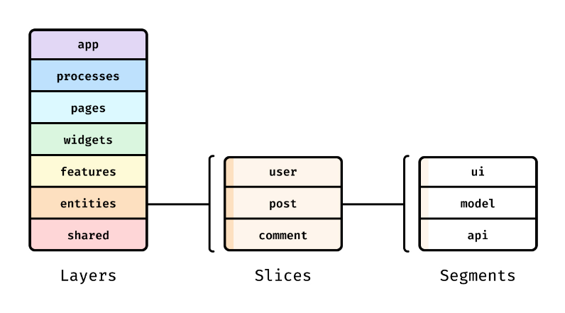

# Sample "React + MUI + TypeScript + Vite" project

This is sample project for "React + MUI" frontend application.

## Requirements

- node v22.x

## Core packages

- Application
  - `react`
  - `react-router`
  - `@mui/material`
  - `zustand`
  - `@tanstack/react-query`
  - `i18next`
  - `react-i18next`
- Bundler
  - `vite`
- Dev Environments
  - `eslint`
  - `prettier`
  - `husky`
  - `lint-staged`
- Test
  - `vitest`
  - `msw`
  - `@testing-library/react`

---

## Structure

Reference : https://feature-sliced.design/kr/docs/get-started/overview


| Order |  Layer   | Description                                                         |
| :---: | :------: | ------------------------------------------------------------------- |
|   1   |   app    | application settings                                                |
|   2   |  pages   | full-page components                                                |
|   3   | widgets  | independent components<br>(like 'Header', 'Footer', 'AppMenu', etc) |
|   4   | services | core business logic                                                 |
|   5   |  shared  | reusable features<br>(like utils)                                   |

---

## How to start

1. Install dependencies

```sh
npm install
```

2. Start dev server

```sh
npm run dev
```
